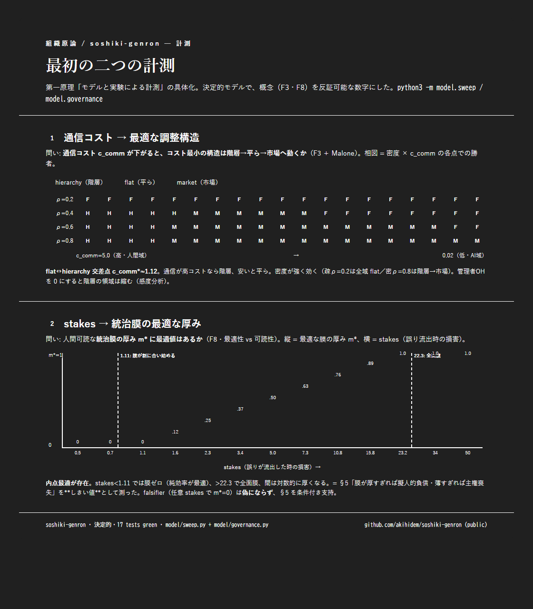

# 組織原論 / soshiki-genron

**人間の組織モデルを起点にせず、「AIにとって組織とは何か」をゼロから問い直す研究。**

私たちは AI のマルチエージェント協調を、無意識に *人間の組織*（チーム・役割・階層・管理者）から借りて設計してきた。だが人間組織の形は、人間という実行主体の限界（狭い通信帯域・忘れる記憶・高い専門家コスト・分散した動機）への**対処**である。AI でその限界の多くは緩む・逆転する。なら借りてきた構造の多くは最適でなく、**擬人的な負債**かもしれない。

このリポジトリは、その問いを主張で終わらせず、**機能から再導出 →（部分的に）実証**するための研究の土台である。

> **第一原理: モデルと実験による科学的計測。** 測れない主張は採らない —— 概念(③)も理論接続(①)も、最終的に実験基盤(②)で*測れる仮説*へ還元する。関連文献も継続調査し、再利用できる形式モデルと先行計測を取り込む（[`docs/literature.md`](docs/literature.md)）。

> ⚠️ これは `tehai`（別の private な姉妹リポ・管理された委譲層 / 人間組織体系を参考に実装）の続きではない。tehai は、この問いを生んだ**一つの実装例・一つのデータ点**にすぎない。本研究は tehai を起点にせず、組織そのものから問い直す。tehai の A/B 実測は参考証拠として引く（数値は本リポ内に転記）。

## ロードマップ ③ → ① → ②

| 段 | 何を | 状態 |
|---|---|---|
| **③ 概念の問い直し** | 「組織」を機能に分解し、各機能の人間版が*なぜその形か（拘束）*を辿り、AIで拘束が成立するかを問う。AIネイティブな形を導く。 | **着手中** → [`docs/foundations.md`](docs/foundations.md) |
| **① 転移マッピング** | ③ を既存の組織論（Coase / Mintzberg / Galbraith / March&Simon / Williamson…）に接続し、体系化。組織論＝人間の限界の科学を AI 用に再導出。 | 並行予定 → [`docs/references.md`](docs/references.md) |
| **② 実験基盤** | 何も前提しない「組織構造 × 課題類型 × 指標」の実験プラットフォーム。③①の主張を反証可能にする。 | 最終目標 |

方法論は [`docs/method.md`](docs/method.md)。**機能から始め、構造から始めない**（構造から始めると人間組織を密輸する）。

## 暫定テーゼ（③ の現時点の到達点・反証歓迎）

> AIネイティブの「組織」はたぶん**組織ではない**。型付き・証拠付き・記憶共有のデータフロー＋オンデマンドのエージェント生成、その上に**薄い人間統治膜**。「チーム/役割/階層」はその人間可読な投影にすぎない。

中心的緊張は **最適性（AIネイティブ・流動・検証中心）vs 可読性（人間が統治・主権を保てる）**。

## 最初の計測（②の胚）— 通信コストと最適構造



第一原理を最初に具体化: 「**通信コスト c_comm が下がると、コスト最小の調整構造は階層→平ら→市場へ動くか**」(F3＋Malone)を決定的モデルで計測。
- **flat↔hierarchy 交差点 c_comm\* ≈ 1.12** — これより通信が高コストなら階層、安いと平らが勝つ。c_comm を下げると勝者は **hierarchy → market → flat**（密度依存）。
- **管理者OHが大きいほど階層の領域は狭い**（感度分析）。検証軸を中立化しても交差点は残る（純調整コスト由来と盲点流出由来を分離）。
- tehai の A/B（実コードの2点観測）と**独立の経路**で同じ向き（通信が安いと平ら有利）を再現 —— 弱い相互裏取り。
- 詳細: [`docs/first-measurement.md`](docs/first-measurement.md)（解釈）／[`model/RESULTS.md`](model/RESULTS.md)（生数値・再生成）。

### 第二の計測 — 統治膜の最適な厚み（最適性 vs 可読性）
研究の**中心的緊張**(F8/§5)を計測: 人間可読な統治膜の厚み m∈[0,1] に最適値はあるか。
- **内点最適が存在**（既定 m\*≈0.73）— 膜ゼロでも全面でもなく**部分的な膜**が最小損失。
- **stakes がしきい値を決める**: stakes<1.11 で m\*=0（純効率最適）／>22.3 で m\*=1（全面膜）／間は対数的に厚くなる。監督が効くほど薄い膜で足りる。
- = §5「膜が厚すぎれば擬人的負債・薄すぎれば主権喪失」を**しきい値**として測った。falsifier（任意 stakes で m\*=0）は**偽にならず** §5 を条件付き支持。
- 詳細: [`docs/second-measurement.md`](docs/second-measurement.md)／[`model/GOVERNANCE.md`](model/GOVERNANCE.md)。

### 第三の計測 — 容量制約と分解粒度（F1）
**エージェント容量 κ が上がると最適な分解粒度 g\* はどう動くか**（限定合理性）。
- **容量が高いほど分解は粗い**: g\* = 50→20→10→5→2→1（κ=2→100）。**AI＝高容量 → 粗い分解**（「人の職サイズ」は AI の自然単位でない）。通信が高いと過負荷を許容してでもさらに粗く。
- AI 域（高 κ・低 c_comm）は正味**粗い分解 → 片が少なく調整辺も少ない → flat を後押し**（第一の計測 F3 と接続）。
- 詳細: [`model/CAPACITY.md`](model/CAPACITY.md)。

### 合成 — 処方マップ
3つの計測を合成し、タスク profile（通信域・stakes）→ 推奨（構造・統治膜）を返す → [`model/DESIGN_MAP.md`](model/DESIGN_MAP.md)。

## 走らせ方
```bash
python3 -m model.sweep         # ① 通信コスト→構造        → model/RESULTS.md
python3 -m model.governance    # ② stakes→統治膜の厚み      → model/GOVERNANCE.md
python3 -m model.capacity      # ③ 容量→分解粒度            → model/CAPACITY.md
python3 -m model.design_map    # 合成: タスク条件→推奨設計   → model/DESIGN_MAP.md
python3 -m unittest discover -s tests -t .   # テスト（25本・決定的・全green）
```

## リポジトリ地図
- `docs/method.md` — 方法論（第一原理＝計測・機能優先・拘束系譜・反擬人化の番人・合否基準）
- `docs/foundations.md` — ③ 本体（最小定義・原始機能 F1–F8・拘束系譜・2つのフロンティア・テーゼ）
- `docs/references.md` — ① の背骨（組織論の正典と「AI再導出の問い」）
- `docs/literature.md` — 文献調査アジェンダ（形式モデル・計算組織論・MAS・近年LLM＝要一次確認）
- `docs/first-measurement.md` / `docs/second-measurement.md` — 計測の解釈・位置づけ
- `model/` — ② の胚: `coordination.py`+`sweep.py`（構造）／`governance.py`（統治膜）／`capacity.py`（分解粒度）／`design_map.py`（合成＝処方マップ）＋生成 `*.md`
- `tests/` — 決定的テスト（25本）

## 到達点（2026-06-21 着手・初日）
- **③ 概念**: 最小定義 + 原始機能 F1–F8 + 拘束系譜 + 2フロンティア（整合の変質 / 統治の残存）+ テーゼ。
- **第一原理**: モデルと実験による計測を最上位規則化。各主張に反証手段を併記。
- **① 文献**: 3件を二次確認・記録（Marschak&Radner チーム理論 / Malone 電子市場 / Carley 計算組織論）。
- **② 計測 3本 + 合成**: 通信コスト→構造（交差点≈1.12）／stakes→統治膜（内点最適・しきい値）／容量→分解粒度（高容量ほど粗い）／処方マップ（タスク条件→推奨）。決定的・**25 tests green**・図あり。
- テーゼの**両半分が測れる対象**になった（機構の効率 と 膜の厚み）。tehai の A/B と独立経路で同じ向き。

## 次の計測（ranked・externally recorded）
1. **人間の誤判定** — 統治膜モデルで監督も間違えるとし、膜の便益の頭打ちを測る。
2. **軸の相互作用** — 構造選択と膜の分離可能性（design_map の仮定）を反証する結合モデル。
3. **一次精読** — 3文献の本文で cost 係数を正当化／反証（Carley の実験データ較正含む）。
4. **F7 整合の形式化** — 「管理→仕様+検証+監督」の最小形を測れるモデルに（最難・要設計）。

> 容量制約軸（F1）は計測済み（[`model/CAPACITY.md`](model/CAPACITY.md)）。

> tehai とは別リポ・別系譜・PUBLIC。次の一手は上記の**どれを深めるかの選択**（研究方向の分岐）。
