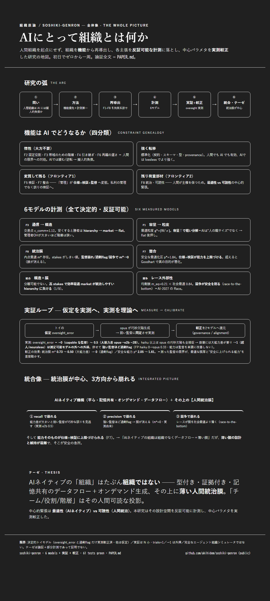
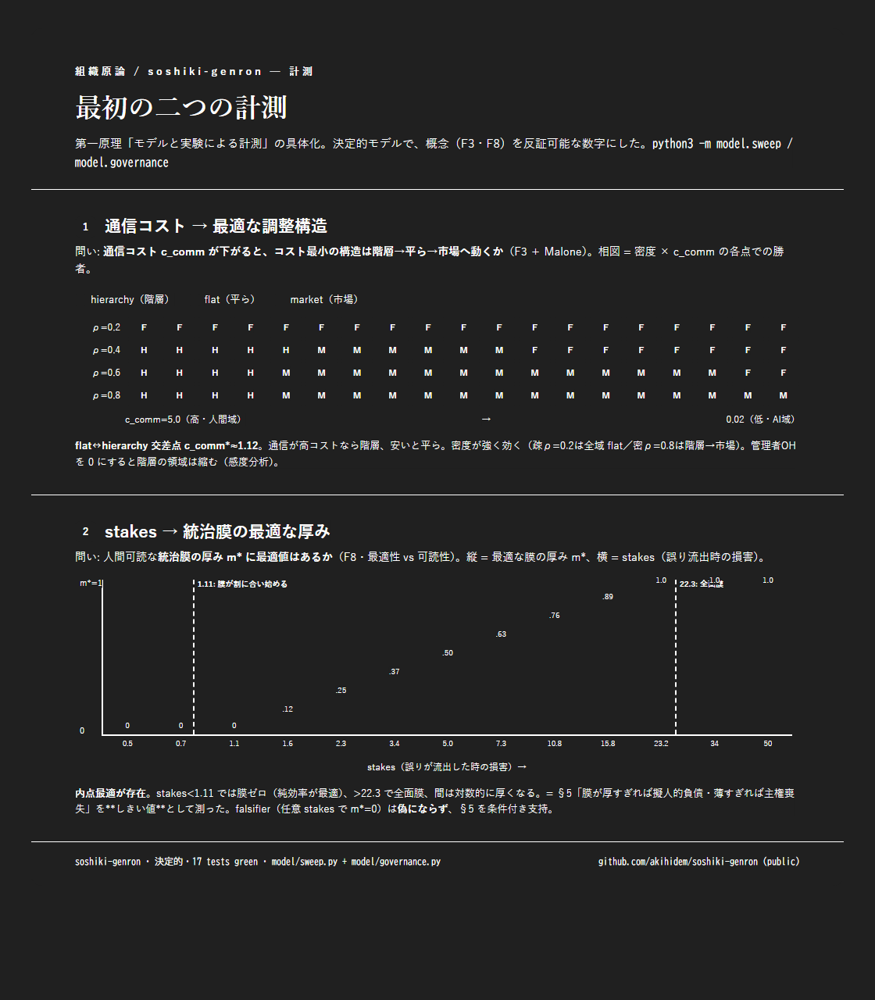

# 組織原論 / soshiki-genron

**人間の組織モデルを起点にせず、「AIにとって組織とは何か」をゼロから問い直す研究。**

私たちは AI のマルチエージェント協調を、無意識に *人間の組織*（チーム・役割・階層・管理者）から借りて設計してきた。だが人間組織の形は、人間という実行主体の限界（狭い通信帯域・忘れる記憶・高い専門家コスト・分散した動機）への**対処**である。AI でその限界の多くは緩む・逆転する。なら借りてきた構造の多くは最適でなく、**擬人的な負債**かもしれない。

このリポジトリは、その問いを主張で終わらせず、**機能から再導出 →（部分的に）実証**するための研究の土台である。

> 📄 **研究全体の論証は [`PAPER.md`](PAPER.md)** ── 問い・方法・機能からの再導出・7モデルの計測・実証（監督/レース/構造/市場3レジーム/Goodhart）・市場支配定理 p\*=w/s・実測較正・AI-2027・限界を一本に束ねた consolidation（まずこれを読めば全体が掴める）。🗺️ 1枚の全体像は [`docs/overview.html`](docs/overview.html):



> **第一原理: モデルと実験による科学的計測。** 測れない主張は採らない —— 概念(③)も理論接続(①)も、最終的に実験基盤(②)で*測れる仮説*へ還元する。関連文献も継続調査し、再利用できる形式モデルと先行計測を取り込む（[`docs/literature.md`](docs/literature.md)）。

> ⚠️ これは `tehai`（別の private な姉妹リポ・管理された委譲層 / 人間組織体系を参考に実装）の続きではない。tehai は、この問いを生んだ**一つの実装例・一つのデータ点**にすぎない。本研究は tehai を起点にせず、組織そのものから問い直す。tehai の A/B 実測は参考証拠として引く（数値は本リポ内に転記）。

## ロードマップ ③ → ① → ②

| 段 | 何を | 状態 |
|---|---|---|
| **③ 概念の問い直し** | 「組織」を機能に分解し、各機能の人間版が*なぜその形か（拘束）*を辿り、AIで拘束が成立するかを問う。AIネイティブな形を導く。 | **着手中** → [`docs/foundations.md`](docs/foundations.md) |
| **① 転移マッピング** | ③ を既存の組織論（Coase / Mintzberg / Galbraith / March&Simon / Williamson…）に接続し、体系化。組織論＝人間の限界の科学を AI 用に再導出。 | 並行予定 → [`docs/references.md`](docs/references.md) |
| **② 実験基盤** | 何も前提しない「組織構造 × 課題類型 × 指標」の実験プラットフォーム。③①の主張を反証可能にする。 | **着手（配置・判定の層のみ）** → [`yoriai`](https://github.com/akihidem/yoriai)。**「課題類型 × 指標」のスイープは未着手** |

方法論は [`docs/method.md`](docs/method.md)。**機能から始め、構造から始めない**（構造から始めると人間組織を密輸する）。

### ② の現状 — [yoriai](https://github.com/akihidem/yoriai)（配置と判定はできた。スイープはまだ）

本研究の処方（段階委譲・外部検証・薄い統治膜）を、実際に**置いて走らせられる canvas** にしたもの。
`gama` を実行エンジンにして、**組織を走らせる前に機械判定する**層を足している。

- 統治膜 m\*、通信コスト、容量 κ は、canvas 上の `stakes` / エッジ / VRAM 予算として操作できる
- **接地率 g < 0.225 の合議には警告を出す**（`souteni` H2。全会一致しても誤りに固まりうる）
- mesh の利得は**大きさで**報告する（`ignites()` は ρ<1 なら常に True なので二値では意味を持たない。
  一度 +0.042 を「創発」と報告して撤回した経緯を境界にしている）

**ただし ② の本体である「組織構造 × 課題類型 × 指標」のスイープはまだ無い。**
canvas は構造を1つ置いて1回走らせるところまでで、構造空間を掃いて相図を描く段には至っていない。
「実験基盤ができた」とは言わない。

## 暫定テーゼ（③ の現時点の到達点・反証歓迎）

> AIネイティブの「組織」はたぶん**組織ではない**。型付き・証拠付き・記憶共有のデータフロー＋オンデマンドのエージェント生成、その上に**薄い人間統治膜**。「チーム/役割/階層」はその人間可読な投影にすぎない。

中心的緊張は **最適性（AIネイティブ・流動・検証中心）vs 可読性（人間が統治・主権を保てる）**。

## 最初の計測（②の胚）— 通信コストと最適構造



第一原理を最初に具体化: 「**通信コスト c_comm が下がると、コスト最小の調整構造は階層→平ら→市場へ動くか**」(F3＋Malone)を決定的モデルで計測。
- **flat↔hierarchy 交差点 c_comm\* ≈ 1.12** — これより通信が高コストなら階層、安いと平らが勝つ。c_comm を下げると勝者は **hierarchy → market → flat**（密度依存）。
- **管理者OHが大きいほど階層の領域は狭い**（感度分析）。検証軸を中立化しても交差点は残る（純調整コスト由来と盲点流出由来を分離）。
- tehai の A/B（実コードの2点観測）と**独立の経路**で同じ向き（通信が安いと平ら有利）を再現 —— 弱い相互裏取り。
- 詳細: [`docs/first-measurement.md`](docs/first-measurement.md)（解釈）／[`model/RESULTS.md`](model/RESULTS.md)（生数値・再生成）。

### 第二の計測 — 統治膜の最適な厚み（最適性 vs 可読性）
研究の**中心的緊張**(F8/§5)を計測: 人間可読な統治膜の厚み m∈[0,1] に最適値はあるか。
- **内点最適が存在**（既定 m\*≈0.73）— 膜ゼロでも全面でもなく**部分的な膜**が最小損失。
- **stakes がしきい値を決める**: stakes<1.11 で m\*=0（純効率最適）／>22.3 で m\*=1（全面膜）／間は対数的に厚くなる。監督が効くほど薄い膜で足りる。
- = §5「膜が厚すぎれば擬人的負債・薄すぎれば主権喪失」を**しきい値**として測った。falsifier（任意 stakes で m\*=0）は**偽にならず** §5 を条件付き支持。
- 詳細: [`docs/second-measurement.md`](docs/second-measurement.md)／[`model/GOVERNANCE.md`](model/GOVERNANCE.md)。

### 第三の計測 — 容量制約と分解粒度（F1）
**エージェント容量 κ が上がると最適な分解粒度 g\* はどう動くか**（限定合理性）。
- **容量が高いほど分解は粗い**: g\* = 50→20→10→5→2→1（κ=2→100）。**AI＝高容量 → 粗い分解**（「人の職サイズ」は AI の自然単位でない）。通信が高いと過負荷を許容してでもさらに粗く。
- AI 域（高 κ・低 c_comm）は正味**粗い分解 → 片が少なく調整辺も少ない → flat を後押し**（第一の計測 F3 と接続）。
- 詳細: [`model/CAPACITY.md`](model/CAPACITY.md)。

### 合成 — 処方マップ
3つの計測を合成し、タスク profile（通信域・stakes）→ 推奨（構造・統治膜）を返す → [`model/DESIGN_MAP.md`](model/DESIGN_MAP.md)。

### レース外部性（AI-2027 が動機）— 競争は統治膜を安全最適より薄くするか
統治膜の単独最適に**多者レース**を足す。各 actor の Nash 均衡膜 m_eq と社会最適 m\* の差を測る。
- **m_eq ＜ m\***（既定 0.21＜0.84・**gap=0.63**）＝安全の race-to-the-bottom を反証可能に確認。
- **レース強度（prize）↑で m_eq→0・gap 拡大** ＝ AI-2027 の **Race ending**。破局を内部化すれば m_eq→m\*（Slowdown）。
- 単独組織の統治膜計測が見落としていた量。詳細: [`docs/ai-2027.md`](docs/ai-2027.md)（本研究との関係）／[`model/RACE.md`](model/RACE.md)。

### 実証: 監督スケーリング（②を実モデルへ接地）
統治膜の `oversight_error` を実エージェントで接地する最初の実証（`experiments/oversight/`）。弱い監督 gemma4:e2b vs 強い gemma4:latest に巧妙さ別の仕込み欠陥をレビューさせた。
- **結果は予想外**: 両者とも全欠陥を FLAWED と判定（仮説＝弱い監督は見逃す、は**再現せず**）。むしろ**強い監督ほど誤検出が多い**（FP 0.33 vs 0.0）＝失敗モードは見逃し(recall)でなく**過剰flag(precision)**。
- **フロンティア勾配**（gemma4:e2b→haiku→sonnet→opus・claude は無料枠 `claude-cli-run.py` 経由）でも **recall は天井**（弱い e2b だけ subtle で 0.667）／**precision は能力とともに悪化**（FP haiku 0→opus 0.33・2実験で再現）。失敗モードは見逃しでなく**過剰flag**。
- **recall crux も実測**: opus が*自分の水準で*生成した巧妙欠陥（subtlety3×6）に対し、**最弱 e2b は半分見逃す（oversight_error=0.5）**／haiku 以上は全部捕捉。＝「十分に弱い監督は強いモデルの巧妙な誤りを見逃す」を実測（ただし崩壊→1 には超人 producer が要り未到達）。
- **B 実装済み**: precision 失敗モードを `governance.py` に項として還流。over-flag 率↑で最適膜は薄くなり、**実測の opus 率 0.33 では m\*=0（膜が消える）**＝強い監督ほど厚い膜が良いとは限らない。詳細: [`docs/oversight-pilot.md`](docs/oversight-pilot.md)。

### 実証: 構造 F3 — flat vs hierarchy vs market（解析の構造軸を実エージェントで接地）
実 LLM（sonnet）に相互依存タスク（設計→実装→テスト）を3構造で組織させ、コスト（コール数）・静的品質・**正しさ（sandbox 実行）** を測った（`experiments/org_sim.py`）。
- コスト flat3<market4<hierarchy5（構造的）／静的品質は全構造 1.0＝**弁別不能**／実行正しさは高く（0.89–1.0）**コストに比例しない** ＝ flat は hierarchy の 60%コストで同等品質。
- 正しさハーネスは **3交絡を潰して初めて** 真の正しさを測れた（pytest形式→shim・多ファイルimport→drop・main()削除の宙ぶらりblock→pass化）＝measurement-first（§9）。

### 市場という組織軸 — 「市場型組織」の価値は能力差に条件付き（3レジーム＋閾値定理）
「市場（競売）型の配分は単一モデルより良いか」を3レジームで実証し、解析で統一した。
- **① 均質（全 sonnet）→ market 最下位**（活かす能力差なし）／**② frontier 異種（haiku/sonnet/opus）→ 勾配ゼロ（全員満点）→ market = flat-haiku**（利得なし）／**③ 大能力差（gemma 2–8B × frontier）→ market が Pareto 支配**（flat-haiku の半額・flat-opus の 1/28 コストで同正しさ）。
- 機構＝**検証ルーティング型エスカレーション**: 安いモデルで試し、外部 gold で落ちた所だけ上位へ。配分は自己申告でなく *実行検証*（外部錨）。
- **支配定理**（`model/market.py`）: market が単一モデルを Pareto 支配 ⟺ **p > w/s**（安いティアの完全解率 > コスト比）。実測③（market 0.311）と解析が厳密一致。trials=3 較正で p=0.889（gap の "leap 失敗" はノイズと判明）・3ローカルモデルの支配地図も実測（`--map`）。
- ⚠️ **支配地図の ✓ は標本誤差の床を通していなかった**（[`model/GAP.md`](model/GAP.md)）。点推定の `p̂ > w/s` は、真に利得ゼロのモデルにも n=6 では **34.5%** の確率で ✓ を立てる。床を通すと **9 ペア中 3 件が「判定不能」**（余裕の小さいセル）。**本節の主結論（③ 大能力差 → market が Pareto 支配・p̂=0.889 ≫ 要 0.667）は床を通しても立つ** ── 崩れたのは地図の周縁セルと、境界に寄るための*計画*の方。
- → **「AIにとって組織とは何か」への答え: 能力が均質なら flat、能力差があれば *検証ルーティング市場*（＝flat＋検証＋オンデマンド agent の最適な呼び出し方）**。詳細: [`experiments/MARKET_GAP.md`](experiments/MARKET_GAP.md)／[`model/MARKET.md`](model/MARKET.md)。

### 実証: レース・Goodhart・通信コスト較正
- **レース**（`experiments/race_game.py`）: LLM を競争主体に見立て安全水準 S を選ばせた。**中立フレーミングで liability が効く**（賠償責任で S 0.3→0.73 回復）＝race.py を実エージェントで支持。AI安全フレーミングは交絡し de-confound が前の結論（mandate≫liability）を**修正**した。
- **Goodhart**（`experiments/goodhart.py`）: proxy（可視テスト）最適化が真の正しさを下げるか。**損 0.217・難タスク集中**（roman 0.6/wildcard 0.7）＝alignment.py の Goodhart 項を実証。圧スイープでは **指数は同定不可・効果は閾値的**（frontier は明示「ハードコード可」まで overfit しない・§9-8）。
- **通信コスト較正**（`experiments/calibrate_coord.py`）: org_sim から **mgr_overhead = hierarchy−flat = 2コール（coordination.py 既定 2.0 と厳密一致）／c_comm（コール単位）≈0 → flat 勝ち** を接地。

### 多モデルの組み合わせ — 安く/確実に迫るが、「超える」のは能力の縁でだけ
原点の問い「複数 AI モデルの組み合わせは単一モデルを*超え*られるか」を実証（`market_external.py` の各モード・**Claude＋local gemma＋OpenAI codex** の異種ベンダ）。
- **escalation 市場** → 最良モデルの水準を*安く*（能力差があれば・超えはしない）／**best-of-N＋検証器** → 弱モデルの*信頼性*を強に近づける（*欠落能力*は作れず・安くもない）。
- **異種ベンダ（opus × codex）** → 全 checkable タスクで完全一致＝union 利得なし。見かけの「codex が opus を救う」は **opus の agentic harness artifact**（「既存ファイルを検証する」と散文だけ返す）だった → `gen_impl` 反agentic化で抑止（§9-9）。
- **創発の源泉＝誤りの脱相関**: frontier は LeetCode-hard でも誤らず脱相関ゼロ。だが**弱い所では実在**（negabinary で gemma が haiku の盲点を覆う）。→ **cross-vendor mesh は「能力の縁」の組織形態** ── 単一モデルが信頼できなくなる所でだけ点火し、仕事が縁へ動くほど価値が上がる。詳細: [`PAPER.md`](PAPER.md) §5。

## 走らせ方
```bash
python3 -m model.sweep         # ① 通信コスト→構造        → model/RESULTS.md
python3 -m model.governance    # ② stakes→統治膜の厚み      → model/GOVERNANCE.md
python3 -m model.capacity      # ③ 容量→分解粒度            → model/CAPACITY.md
python3 -m model.design_map    # 合成: タスク条件→推奨設計   → model/DESIGN_MAP.md
python3 -m model.joint         # 結合: 構造×膜（分離可能性の反証） → model/JOINT.md
python3 -m model.race          # レース外部性（AI-2027 動機）      → model/RACE.md
python3 -m model.alignment     # F7 整合（仕様+検証が能力を上限）   → model/ALIGNMENT.md
python3 -m model.market        # 市場支配定理 p*=w/s（3レジーム統一） → model/MARKET.md
python3 -m model.mesh          # mesh 点火（相互相補 gain=min(a,b)/n・実測は trials=2） → model/MESH.md
python3 -m model.noise         # 検出床（非決定な採点の下で報告してよい最小 gain） → model/NOISE.md
python3 -m model.gap           # 判定分解能の床（境界 p*=w/s に寄るのに要る n）    → model/GAP.md
python3 -m model.replication   # 複製深度(trials)の台帳＋群間比較の検出床（n の値段）→ model/REPLICATION.md
python3 -m experiments.market_external --regate  # 支配地図を床で再判定（LLM 呼び出しゼロ）
python3 -m experiments.oversight.calibrate   # 実測較正: 測った oversight_error を両モデルへ → CALIBRATION.md
python3 -m experiments.oversight.run         # 実証: 監督スケーリング（mock即時／--backend ollama で実測）
python3 -m experiments.org_sim --agent claude:sonnet --tasks 3   # 実証: 構造 F3（flat/hierarchy/market・正しさ）
python3 -m experiments.market_external --gap --agent claude:real # 実証: 大能力差で market が Pareto 支配（gemma×frontier）
python3 -m experiments.market_external --ladder --agent claude:real  # 異種ベンダ難易度ラダー（gemma/haiku/sonnet/opus/codex）
python3 -m experiments.market_external --ensemble --agent claude:real # 弱 best-of-N が検証器付きで強に迫るか
python3 -m experiments.market_external --decorr --agent claude:real   # mesh 概念実証: 弱モデルの誤りは脱相関するか
python3 -m experiments.market_external --openended --agent claude:real # open-ended: cross-vendor 合成は単独を超えるか（LLM-judge）
python3 -m experiments.goodhart --agent claude:sonnet            # 実証: Goodhart（proxy 最適化 vs 真の正しさ）
python3 -m experiments.race_game --players claude:haiku,claude:sonnet --framing neutral  # 実証: レース外部性
python3 -m experiments.calibrate_coord       # 較正: 通信コスト（org_sim → mgr_overhead/c_comm）
python3 -m experiments.meshflow              # 採用組織図の動く実行系（検証ルーティング→mesh→人間膜・決定的）
python3 -m unittest discover -s tests -t .   # テスト（278本・決定的mock・全green）
```

## リポジトリ地図
- `docs/method.md` — 方法論（第一原理＝計測・機能優先・拘束系譜・反擬人化の番人・合否基準）
- `docs/foundations.md` — ③ 本体（最小定義・原始機能 F1–F8・拘束系譜・2つのフロンティア・テーゼ）
- `docs/references.md` — ① の背骨（組織論の正典と「AI再導出の問い」）
- `docs/literature.md` — 文献調査アジェンダ（形式モデル・計算組織論・MAS・近年LLM＝要一次確認）
- `docs/first-measurement.md` / `docs/second-measurement.md` — 計測の解釈・位置づけ
- `docs/ai-2027.md` — AI-2027（実存リスクのシナリオ予測）と本研究の対応・レース計測の動機
- `model/` — ② の胚: `coordination.py`+`sweep.py`（構造）／`governance.py`（統治膜）／`capacity.py`（分解粒度）／`design_map.py`（合成）／`joint.py`（構造×膜の結合）／`race.py`（レース外部性）／`alignment.py`（F7 整合）／`market.py`（市場支配定理 p\*=w/s）／`mesh.py`（mesh 点火＝相互相補）／`noise.py`（**検出床**＝非決定な採点の下で報告してよい最小 gain）／`gap.py`（**判定分解能の床**＝境界 p\*=w/s に寄るのに要る標本数 n）＋生成 `*.md`
- `experiments/oversight/` — 監督スケーリング実証＋ `calibrate.py`（測定値を governance/alignment へ還す実測較正）／`docs/oversight-pilot.md`
- `experiments/` — 実証ハーネス群: `org_sim.py`（構造 F3・sandbox 正しさ）／`race_game.py`（レース外部性・2フレーミング）／`market_external.py`（市場3レジーム・外部 gold・**異種ベンダ**＝Claude/gemma/**codex**・`--gap`/`--ladder`/`--ensemble`/`--decorr`/`--novel`/`--openended`/`--map`/`--calibrate`）／`goodhart.py`（code-overfitting・`--curve`）／`calibrate_coord.py`（通信コスト較正）＋生成 `*.md`
- `tests/` — 決定的テスト（278本・全 mock・green）。`test_generated_docs.py` は生成 `*.md`/`*.json` が生成元コードとずれていたら落とす床（散文が数値とずれる事故を機械で防ぐ）／`test_suite_integrity.py` は **テスト群そのものの床**（① 正典 runner から見えない test モジュール＝素の pytest 関数だけの module を落とす ② README の本数が実測とずれたら落とす）

## 到達点（2026-06-21 着手〜）
- **③ 概念**: 最小定義 + 原始機能 F1–F8 + 拘束系譜 + 2フロンティア（整合の変質 / 統治の残存）+ テーゼ。
- **第一原理**: モデルと実験による計測を最上位規則化。各主張に反証手段を併記。
- **① 文献**: 3件を二次確認・記録（Marschak&Radner チーム理論 / Malone 電子市場 / Carley 計算組織論）。
- **② 解析モデル 11本**: 通信コスト→構造（交差点≈1.12）／stakes→統治膜（内点最適）／容量→分解粒度／処方マップ／構造×膜の結合／レース外部性＋制度内部化／F7 整合（Goodhart）／**市場支配定理 p\*=w/s**／mesh 点火（相互相補）／**検出床**（noise）／**判定分解能の床**（gap＝境界に寄るのに要る n）。
- **② 実証 6軸**（実 LLM・無料枠＋local gemma）: 監督スケーリング（recall/precision 接地）／レース（中立で liability 有効）／構造 F3（flat 安く同等品質）／**市場3レジーム（能力差で market が Pareto 支配・床を通しても成立 p̂=0.889≫0.667）**／Goodhart（損 0.217・指数は閾値的で同定不可）／通信コスト較正（mgr_overhead=2コール）。決定的部分 **278 tests green**。
- **実測較正**: oversight_error・過剰flag・mgr_overhead（=2コール）・市場閾値 p（trials=3）・spec_quality（0.57–0.78）を実エージェントで接地。
- **方法論**: 計測過程で結論が3度自己修正＋**12 の転移可能な教訓**（n=1/フレーミング/harness 交絡/自己評価のモデル依存/外部基準の誤り/係数の非同定性/**点推定の符号比較を判定に使うな＝境界に寄る前に分解能を計算しろ**…）＝measurement-first が外部錨として機能（PAPER §9）。

### 統計強化 — n=1 ノイズを prose の caveat でなく**判定器**にした（[`model/NOISE.md`](model/NOISE.md)）

「trials>1 を全実証へ」を、各実験に trials を足す前に**床**として定式化した。実測が非決定な採点
ハーネス（`claude-cli-run` 経由の opus は **3/24＝12.5% のセル不一致**・codex は完全再現）に載っている以上、
**mesh 利得は真の相補がゼロでもノイズだけで立つ**からである。

- **恒等式**: 実測の mesh 利得 = **min(a, b)/n**（a=|A\B|, b=|B\A|）⟹ 利得>0 ⟺ *相互*相補。
  「入れ子なら ρ<1 でも点火しない」は観察でなく**この恒等式の系**になった。
- **検出床**: H0（相互相補ゼロ）＋実測ノイズの下で観測利得の**厳密な**帰無分布を畳み込み、
  P(min(a,b) ≥ m) ≤ 0.05 となる最小 m を返す。**利得が床を超えない限り「点火」と報告しない**。
- **撤回は運でなく予測可能だった**: 一度「real frontier で初の点火」と報告して撤回した **+0.042**
  （[`experiments/SWEBENCH_TRIALS.md`](experiments/SWEBENCH_TRIALS.md)）は **1 タスク分**で、
  trials=1 の床は **3 タスク（0.125）**＝**床の 1/3**。H0＋opus のノイズだけで同じ観測が出る確率は
  **0.68**（＝ノイズの*期待される*出力）。**trial-2 を回す前に計算できた。**
- **副産物**: 解析モデルが依存する ρ 自体も単一試行では決まらない（同じ N=24 で **0.61 → 0.89** に振れる）。
- **回帰の修正**: `model/mesh.py` は撤回の*翌日*に trial-1 のベクトルを取り込み「初の点火」を再公開しており、
  テストが `assertTrue(ignites)` でそれを固定していた。実測点を **trials=2 の頑健値のみ**に差し替え、
  `ignites` を床でゲートした（撤回済みの点は `retracted` として*見える形で*残す）。

### 判定分解能の床 — 「境界に寄せて実測」は *n=6 では原理的に空振り* だった（[`model/GAP.md`](model/GAP.md)）

支配定理 p\*=w/s は**真の p** の話だが、実験が持つのは推定量 p̂ にすぎない。実測側は
`dominates = (p̂ > w/s)` と**点推定をそのまま二値判定**しており、これは `noise.py` が mesh 軸で
潰したのと同型の fail-open だった。境界の近傍ではこの符号比較は純ノイズになる ── そして
「境界に寄せる」とは、定義上その近傍へ行くことである。

- **第一種過誤 0.345**: 真に境界上（市場の利得ゼロ）のモデルにも、現行手続きは n=6 で **3回に1回 ✓ を立てる**。床を通せば 0.017（≤α）。
- **n=6 では支配の主張が反証不能**: 下側の枝が空で、**p̂=0/6（全問不正解）ですら「非支配」と言えない**（P(X=0 | p=0.2) = 0.262 > α）。より弱いモデルを足すほど判定不能帯の奥へ入るだけ。
- **trials では買えない**: Var(p̂) = [Var_task(p_i) + E[p_i(1−p_i)]/t] / n。第1項は trials で消えない。per-task が 0/1 に張り付く実測（gemma4:e2b = 1,1,1,0,1,1 ＝ 能力差が*構造的*）では E[p_i(1−p_i)]=0 となり **trials の寄与は厳密にゼロ**。NOISE.md が mesh 軸で出した「trials より先に n」と同じ結論に、別の軸から到達した。
- **値段**: 反証可能性の発生に **n≥14**、境界から δ=0.10 の分解能に **n=67**、δ=0.05 に **n=224**。
- 床は厳密二項（正規近似なし）。α 準拠は `verdict()` を通した全観測の列挙＋有理数演算で*独立に*検証（`tests/test_gap.py`）。

## 次の計測（ranked・externally recorded）
1. ~~**能力差の連続スイープ** — より弱いモデル/難タスクで境界(p≈w/s)に寄せて実測。~~
   → **この計画は実行前に反証された**（[`model/GAP.md`](model/GAP.md)）。n=6 では境界の近傍が
   *そもそも判定不能*で、下側の枝が空＝**どんな観測でも「非支配」を言えない**（p̂=0/6 ですら帰無と両立）。
   弱いモデルを足すほど判定不能帯の奥へ入るだけで、n=6 のままでは空振りが確定していた。
   **書き換え後の次の一手 = n を増やす**（反証可能性の発生に **n≥14**・境界から δ=0.05 の分解能に **n=224**）。
   タスク集合を 6 → 24+ に拡張してから弱モデル掃引を回す。
2. **統計強化の残り** — 床はできた（上）。**「trials>1 を全実証へ」の意味が変わった**
   （[`model/REPLICATION.md`](model/REPLICATION.md)）: trials が買うのは精度でなく
   **[`model/NOISE.md`](model/NOISE.md) の床を適用可能にする前提条件**である（セル反転率 f は
   d=2f(1−f) から推定するので t≥2 が要る ⟹ **t=1 の実測は「床を超えていない」のでなく「床を計算できない」**）。
   台帳を機械化した結果:
   - 実測成果物 52 件のうち深度を宣言しているのは **19 件（37%）**。**33 件は復元不能**＝負債かどうかすら判定できない。
     → 台帳の最初の一手は「trials を増やす」でなく **`trials` を書き出す**こと。
   - 未免除の trials=1 は **`role_division_repair_real.json` の1件**。これが `docs/deployment-architecture.md` の
     処方（「役割を切らない」）を単独で支えていた。厳密符号検定を通すと **5 主張すべて p ≥ 0.25・有意 0 件**。
   - **検出力は n が買う**: 対応二値の符号検定で到達可能な最小 p は 2^(1−n) ⟹ **n≤5 ではどんな観測も有意にならない**。
     n=3 の `role_division_real.json` は trials=2 を持っていても原理的に空振り。
   - 残り: `goodhart.py`（「中間圧の非単調は n=1 ノイズ」と自認済み）／`org_sim.py`／`repair.py`／
     `oversight/calibrate.py`。**n≥6 かつ trials≥2** が再測の最低要件。
3. **一次精読** — 3文献の本文で cost 係数を正当化／反証（Carley の実験データ較正含む）。

> 計測済み: 容量制約 F1（[`model/CAPACITY.md`](model/CAPACITY.md)）／人間の誤判定（`oversight_error` 軸）／軸の相互作用（[`model/JOINT.md`](model/JOINT.md)・分離可能性は高 stakes で破れる）／**レース外部性**（[`model/RACE.md`](model/RACE.md)）／**F7 整合**（[`model/ALIGNMENT.md`](model/ALIGNMENT.md)・仕様+検証が能力 p\* を上限づけ・超えると Goodhart）／**制度内部化**（[`model/RACE.md`](model/RACE.md)・race gap を賠償責任λ=0.25で82%・規制標準・共有検証で回復＝Race↔Slowdown の定量分岐）／**実測較正**（測った oversight_error 0〜0.5・過剰flag 0.33 を governance/alignment に還元 → 大能力差で膜 0.73→0.50、過剰flag で m\*=0、安全な能力 p\* 2.05→1.61）。

> **実証着手**（解析→実測）: 監督スケーリングの第一パイロット（[`docs/oversight-pilot.md`](docs/oversight-pilot.md)）は仮説を**否定**＝oversight_error はまだ未接地。失敗モードは recall でなく precision の可能性。measurement-first が機能。

> tehai とは別リポ・別系譜・PUBLIC。次の一手は上記の**どれを深めるかの選択**（研究方向の分岐）。
